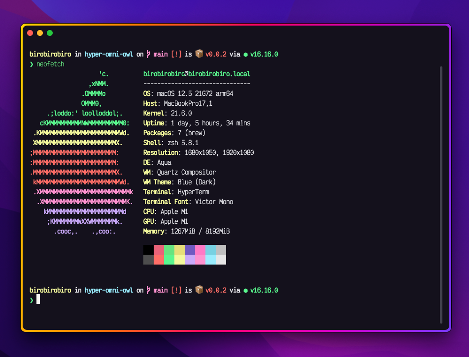

# Omni Owl for [Hyper](https://hyper.is)

<div align="center">

</div>

<div align="center">

</div>

> A dark theme for [Hyper](https://hyper.is).

## Install

```bash
hyper i hyper-theme-omni-owl
```

## Team

[](https://github.com/birobirobiro)

## License

[MIT License](./LICENSE)
